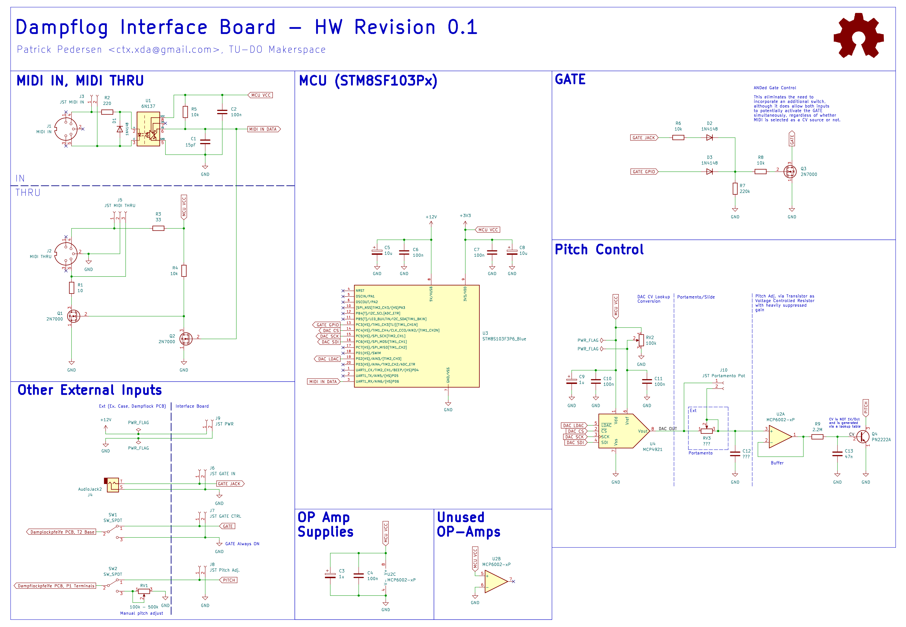
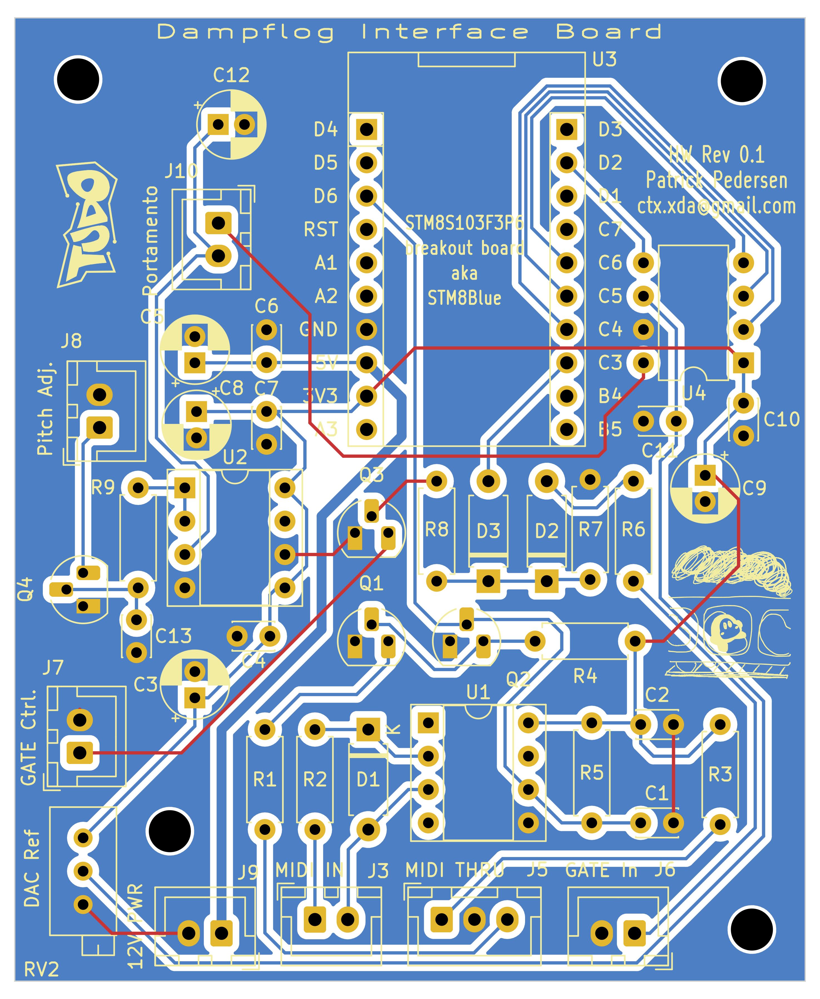
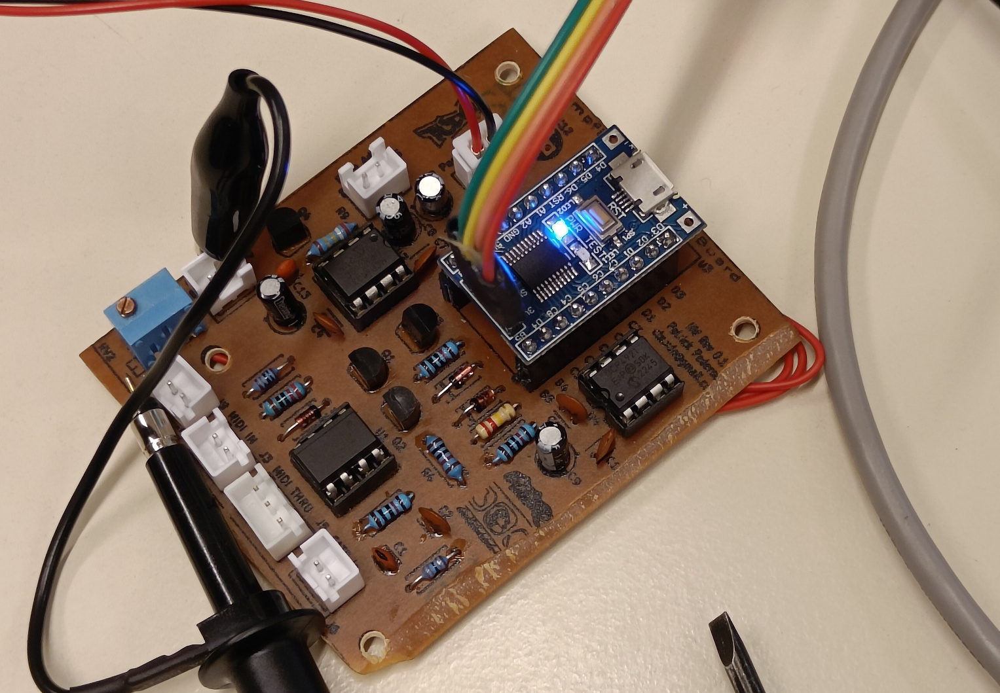
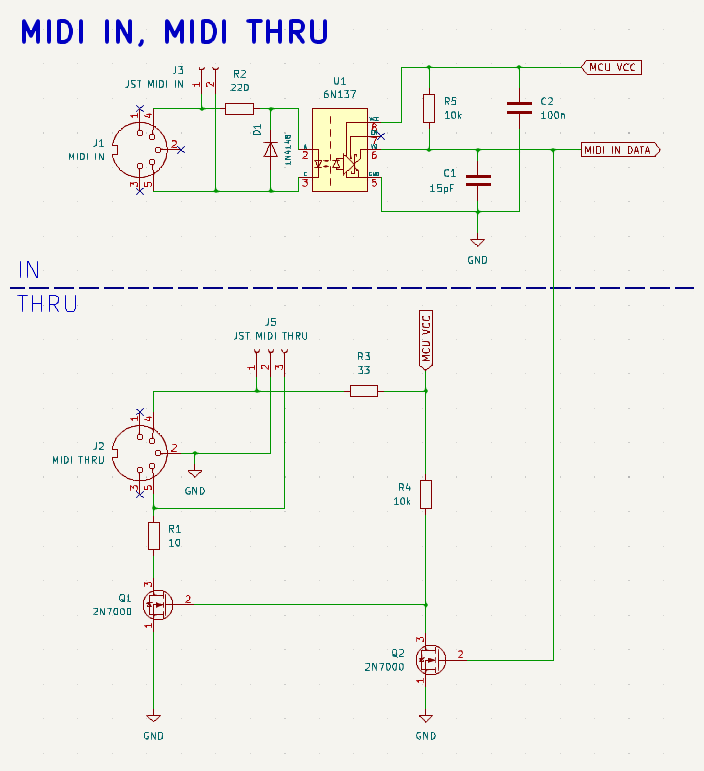
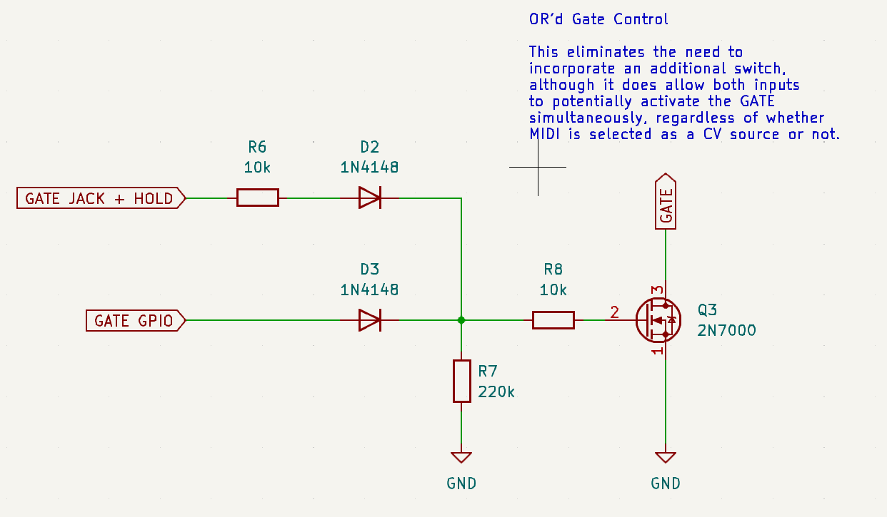
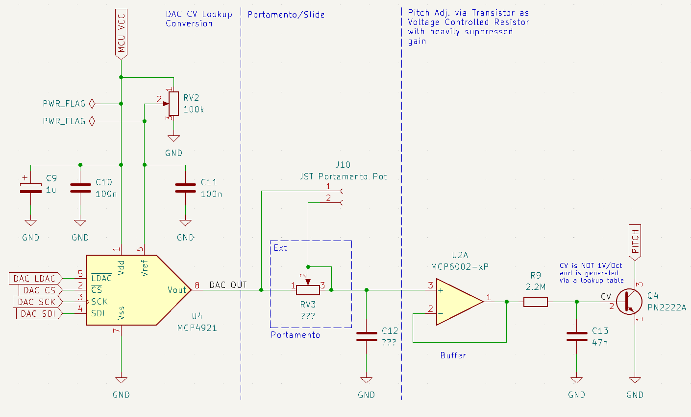
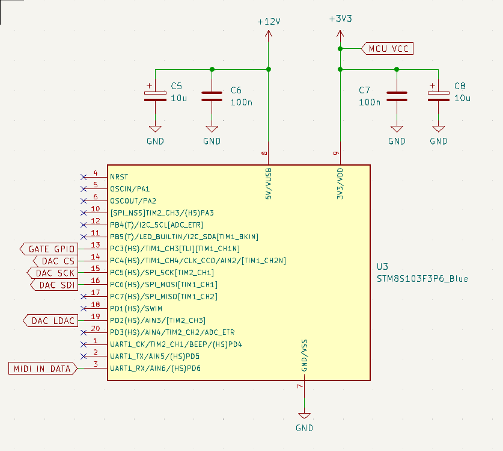

# Dampflog Interface Board

> This README is WIP

Within this directory, you will find the firmware and KiCad project for the Dampflog Interface Board. The primary objective of this interface board is to equpt the Dampflog with a digital interface, specifically through MIDI. It accepts MIDI input and manages the Dampflog's gate and pitch in accordance with the note command it receives. It also has a MIDI thu output, allowing the dampflog to be daisy-chained with other MIDI devices.

# Hardware

## Showcase

The Interface Board resides as a single layer PCB withing the enclosure of the Dampflog. It is connected to the [Dampflockpfeife PCB](../README.md) and other external components through JST XH connectors. The board accepts a 12V power supply which is regulated down
via a linear regulator to 3.3V through a STM8S devboard that resides on the Interface Board. While this voltage difference is not ideal, the current consumption is low enough that the regulator does not become hot.

Here's the schematic:

And here's the PCB layout:

The red traces do not represent real traces, but rather jumper wires. Here's the rather sloppy result:

In hinsight I was overly optimistic with the clearances on the PCB. As a result there were some traces that ended up shorting after
the board was etched. Some of them could be saved by seperating the traces with a knife, but others were so messed up I simply broke the connections and used jumper wires instead. 

## Overview

The Interface Board consists four parts:

- MIDI Input & Thru
- Gate Output
- Pitch Control
- Microcontroller

### MIDI Input & Thru

For the MIDI Input and Thru circuit, I simply referenced a [template design I made a while ago](https://github.com/TU-DO-Makerspace/KiCAD-MIDI-Templates). The MIDI IN circuit operates on 3.3V and uses a 6N137 Optocoupler. The MIDI THRU circuit is connected in parallel to the optocoupler output and simply buffers the incomign signal to the MIDI thru port.

## Gate Output

For the GATE output, the board actually accepts the manual GATE controlls (Gate JACK and HOLD switch) as an input, and simply OR's it with the Microcontroller's GATE output using two diodes and a pull down resistor. The MCU's GATE output is simply driven by a GPIO.

## Pitch Control

The pitch control circuit primarily comprises three key components: a DAC, a buffer, and a common-emitter transistor connected to the Dampflockpfeife PCB's oscillator, thereby controlling the pitch. Situated between the DAC and the buffer is an adjustable low-pass filter which allows for slide/portamento by delaying changes in the CV signal.

The chosen DAC is a [MCP4921](https://ww1.microchip.com/downloads/en/DeviceDoc/21897B.pdf), providing 12-bit resolution and can be controlled via an SPI interface. The buffer is implemented using a single-supply rail-to-rail [MCP6002](https://www.reichelt.de/index.html?ACTION=7&LA=3&OPEN=0&INDEX=0&FILENAME=A200%2FMCP6002_MCP6004_MIC.pdf).

The buffer's output is wired to a 2N2222A NPN transistor's base with a 2.2MOhm resistor.
This controls the pitch of the oscillator. The high base resistor supresses the transistor's gain, providing a more linear current control. With that said: A too large base resistor would limit the circuits ability to step through the oscillator's complete pitch range. Hence, the base resistor was chosen to still allow the DAC to reach the full pitch range of the oscillator with the MCU's 3.3V supply voltage. Another issue with large resistances is that the paths high impedance becomes more susceptible to noise. To minimize this effect, the trace was kept as short as possible. The ground plane surrounding the trace also helps to supress noise.

Lastly, the DAC also accepts a external reference voltage, defining its maximum output voltage. A smaller reference voltage gives us smaller voltage steps, and thus finer resolution at the expense of range. To maximize resolution, we want the external reference voltage reference to match the base voltage required to reach reach the highest possible tone of the oscillator. To achieve this, the DAC's external voltage reference is connected to a trim potentiometer that can be adjusted to maximize the DAC's resolution.

PICTURE OF TRIM POT

The choice of components was mostly based on what was readily available in our Makerspace already.

## Microcontroller

The microcontroller forms the brain of the interface board. It is responsible for reading the MIDI input and consequently controlling the Damplogs GATE and pitch. The chosen MCU is a STM8S103F3P6 which is not directly mounted on the interface board, but rather comes on a devboard. The devboard also provides a 3.3V regulator which also provides a voltage supply for other ICs on the interface board.  

The STM8S can be programmed with an ST-LINK using the SWIM interface. The cheap chinese ST-LINK clones will also do the job. For those wondering why I didn't choose a more common platform such as an Arduino or a Pi Pico. Well, for one, the STM8 devboards are dirt cheap (we're talking 80Cents per board). Another reason is because I have past experience with MIDI on the STM8S platform, allowing me to recycle a good chunk of code. The firmware will be discussed in the next section.

# Firmware

The firmware is written in C and compiled with SDCC. I also make use of the [STM8S Standard Peripheral Library]() which provides a minimal abstraction layer for the STM8S's peripherals. The firmware is rather simple, and simply listens for UART RX interrupts. When a UART RX interrupt has been received, it is evaluated for MIDI. If the input forms a valid and supported MIDI message, the appropriate action is taken. Currently, the firmware supports the following MIDI messages:

- `Note On`
- `Note Off`

Upon `Note On`, the note number is mapped to a DAC value using a lookup table found in [include/midi_2_dac.h](include/midi_2_dac.h). The DAC value is then written to the DAC via SPI and the GATE is turned on. Upon `Note Off`, the GATE is simply turned off.

Notes that are out of the oscillators range are simply mapped to the highest or lowest possible note.

Perhaps as an interesting side note: When a debug build is compiled, the firmware will also listen for SYSEX messages. There are two supported SYSEX messages:

- `SET DAC <DAC VALUE MSB> <DAC VALUE LSB>`
- `SET GATE <GATE VALUE>`

The `SET DAC` command allows one to manually set the DACs value. This is actually used to generate the "MIDI 2 DAC" lookup table found in [include/midi_2_dac.h] via a python script found in [tools/tune.py]. The `SET GATE` command allows one to manually set the GATE output, which proved to simply be useful for debugging and testing during development.

The debug build also prints a verbose log via UART. To save space and especially processing time, logging and SYSEX are disabled in non-debug builds.

For a more elaborate understanding of the firmware, feel free to browse its source code. The codebase is pretty small and I have made sure to provide a fair amount of comments.
